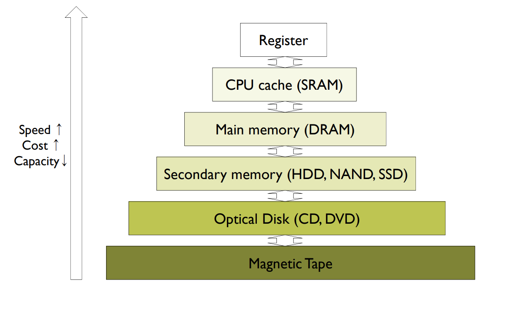

# 운영체제 1장

- 학습목표
  - 운영체제의 역할을 설명할 수 있다.
  - 컴퓨터 시스템의 동작 방식을 설명할 수 있다.
  - 운영체제의 구성 요소를 설명할 수 있다.

## operating system definition

#### Four components of a computer system

- Hardware
  - central processing unit ( CPU )
  - memory
  - I/O devices
- operating system
  - control hardware and coordinate its use among various application for various users
  - 이러한 자원들에 대한 적절한 사용방법 제시
  - 다른 프로그램이 효율적인 작업을 할 수 있는 환경 제공
- application programs
- Users

#### definition of operating system

- User view
  - os executes the application (compromise between individual usability and resource utilization)
- System view
  - resource allocator
  - control program

- The program running at all times on the computer
  - Kernel - 항상 수행되고 있는 프로그램
  - 이외의 다른 것은 다른 시스템 프로그램이나 응용프로그램

## Computer System Operation


- Each IO Device controller has a local buffer.
- Disk Controller moves data from/to device to/from local buffer of device controller.
- Cpu moves data from/to main memory to /from local buffers of device controller.
- CPU, I/O Device can perform independently
  - Device controller informs CPU that it finished its operation by interrupt.

#### purpose of Interrupt

- 입출력에서 작업이 끝났을때
- 각 단계에서 적절한 제어가 필요할때 

발생시켜 CPU가 처리를 할 수 있게함

**인터럽트에는 우선순위가 있어 중요한 처리를 우선적 처리가능**


#### Interrupt Handling


- interrupt vector table에는 인터럽트가 발생한 프로그램일부의 주소를 알려줌

- ISR(interrupt service routine)을 진행함

- Interrupt timeline

  

  - 실행흐름
    - 인터럽트가 발생되면 cpu 실행중인 작업 중단
    - 실행을 fixed location에 전송 (interrupt vector table)
    - 인터럽트가 발생한 주소 실행(indexed by a unique device number, given with the interrupt request)
    - Interrupt transfers control to the interrupt service routine(ISR) - ISR로 컨트롤 전송
    - 인터럽트 아키텍쳐는 인터럽트로인해 중지된 주소를 저장해야함
    - 인터럽트가 서비스 되면 return할 저장된 주소를 다시 program counter에 load, 다시 재개
  - Hardware : system bus 로 interrupt 발생시킴
  - Software : system call 로 발생시킴

## Storage Structure

- Main memory
  
  - Storage media that CPU can access directly
  - DRAM : Dynamic random Access Memory
    - Volatile ( 휘발성 - 전원 꺼지면 사라짐)
- Secondary memory
  
  - sotrage media that provides large <b>nonvolatile</b> storage capacity
  - HDD : Hard Disk Drives)
  - NAND flash memory
  - SSD (Solid State Drives)

#### Storage hierachy



- volatility 는 낮은 hierachy에만 지원

- The characteristics of different storage media

  

## Caching

- To execute program,

  

  위로올라갈 수록 용량이 적기 때문에 HDD부터 적재된 프로그램에 메모리로 올려서 수행됨

  copying information into faster storage system

  하드의 일부를 메인메모리의 캐싱 ...

- Caching - stores data in faster storage media (같은 데이터를 이미 로딩후 성능이 좋은곳에 캐싱함)

  - in order to improve the access speed for future requests of same data.

  - Generally, cache size is limited.

    - Replacement policy is required
    - LRU, LFU, clock
    - [알고리즘 참고](<https://eunhyejung.github.io/os/2018/07/24/operatingsystem-study15.html>)

  - Caching is performed at <b>many levels</b> in a system or in many environments

    - CPU Cache, operating system's buffer cache, disk, cache, etc.
    - web cache, streaming cache, etc.

  - Cache is first checked to determine if the requested data are there.

    - 있으면 -> data are used directly from the cache
    - 없으면 -> data are copied to cache and used there
    - 속도차이가 엄청남

  - Cached data should be more carefully handled.

    - Data Inconsistency

  - In multiprocessor environment

    - Cache coherency

      - All CPUs have the most recent value in their cache.

        

## Operating system structure

- multiprogramming과 time sharing 은 run program simultaneously

#### Multiprogramming

- Several programs are <b>kept</b> in main memory at the same time, and CPU is multiplexed among them. -> <b>increase CPU utilization</b>
  - 목적 : CPU 활용도 증가
  - 메인메모리에 한번에 수행되는게 아니라 적재됨
  - Single program cannot kept CPU and I/O devices busy at all times
  - Oraganizes programs so CPU always has one to execute.
  - One program is selected and run via scheduling
  - when it has to wait(I/O requests), OS switches to another program.
  - job scheduling 을 통해 메모리에 job이 적재되거나 메모리로부터 제거된다.
    - 메모리내 프로세스의 수를 조절
  - cpu scheduling
    - 작업중 어떤 것을 할당할지 선택
- 단점
  - do not provide for user interaction with the computer system
    - 사용자는 실행중인 작업에 대해서는 관여하지못함
  - 반드시 여러개의 프로그램들이 메모리에 존재해야함
    - 하나의 프로그램이면 입출력작업이 완료될때까지 프로세서가 기다려야함

#### time sharing

- logical extension of multiprogramming.
- UNIX is good example
- CPU switches programs so frequently that users can interact with each program. -> minimize the response time

#### 공유환경에서의 문제점

-  One user can read the private data of another user - privacy.

- One user can corrupt the private data of another user - integrity.

- One user can prevent another user from getting anything done - denial of service.
- 정보보호, 무결성, 서비스 거부

#### Operating System Operations

- OS is <b>event driven</b>
  - when no programs, no I/O requests, and no users, 
  - OS will sit quietly waiting for some events to happen.
- Events
  - Hardware interrupts - disk interrupt, keyboard interrupt, mouse interrupt, etc.
  - Software trap(exceptions)
    - divide by zero, invalid memory access, system call(의도적으로 발생시킨 것) etc
      - system call
        - 커널모드로 특정기능을 수행하도록 요청하기 위해서 사용
    - user program 에서 발생된 인터럽트
  - Other errors
    - infinite loop

#### Dual mode

- <b>User mode</b> and <b>kernel mode</b>

- allows OS to protect itself and other system components

- Dual mode = Privileged instructions are exceutable in kernel mode.

- <b>Mode bit</b> provided by hardware (program status word, PSW)

  - 현재 시스템이 어디서 실행되고 있는지 구별
  - User mode (1) or kernel mode(0)

  

## process Management

- A process is a program in excecution
  - program is a <b>passive</b> entity, process is an <b>active</b> entity
  - It is a unit of work within the system.
- Process needs resources to accomplish its task
  - CPU, memory, I/O devices, files
- Process management activities
  - Scheduling process on the cpus
  - Creating and deleting process
  - process synchronization mechanisms
  - Inter-process communication mecahnisms
  - Deadlock handling

## Memory Management

#### Memory management activities

- Keeping track of witch parts of memory are currently being used by whom
- Deciding which process and data to move into and out of memory
- Allocating and deallocating memory space as needed

#### Virtual memory system

- Virtualizes various forms of data storage( DRAM and disk) allowing a program to be designed as though there is only one kind of memory, "virtual" memory
- 다양한 형태의 데이터 스토리지(D램 및 디스크)를 가상화하여 마치 하나의 메모리인 "가상" 메모리만 있는 것처럼 프로그램을 설계할 수 있다.

## Storage Management = File system

- OS provides uniform, logical view of information storage
  - File
    - logical storage unit
    - Files are usually organized into directories
  - File system
    - means to store, retrieve and update data, as well as manage the availiable space on the device
- File system activities
  - creating and deleting files and directories
  - supporting primitives to manipulate files and direcotries
  - Mapping files onto secondary storage

#### Mass-storage management

- Usually disks are used to store data
- Entire speed of computer operation depends on <b>disk subsystem and its algorithms</b>
- magnetic tape..

#### Disk storage activities

- Free-space management
- Storage allocation
- disk scheduling

## I/O Subsystem

#### One purpose of OS is

- to hide peculiarities of hardware devices from the user
  사용자에게 하드웨어 장치의 특성을 숨기다

  ```
  하드웨어 추상화 계층(HAL, Hardware Abstraction Layer)은 컴퓨터의 물리적인 하드웨어와 컴퓨터에서 실행되는 소프트웨어 사이의 추상화 계층이다. 이것은 하드웨어의 차이를 숨겨서 응용 프로그램이 작동할 수 있는 일관된 플랫폼을 제공한다.
  ```

  [하드웨어 추상화](https://ko.wikipedia.org/wiki/%ED%95%98%EB%93%9C%EC%9B%A8%EC%96%B4_%EC%B6%94%EC%83%81%ED%99%94)

#### I/O subsystem consists of

- general device-driver interface
- Drivers for specific hardware devices
- Memory management of I/O including
  - buffering
  - caching
  - Spooling

## Special purpose system

- Real time system
  - <b>Deadline</b> - rigind response time requirment
  - Missile control system, mediacl equipment system
- Multimedia systems
  - Soft real-time requirements
- Mobile systems
  - Low H/W capabilities
    - Slow processors, limited memory, small display screens, limited power

## Virtutal machines

#### Virtual machines

- Abstract a single computer into several diffrent execution environments

- Create illusion that each seperate execution environment uses its own computer

- **Treats hardware and kernel as though they were all hardware.**

  

#### Features of virtual virtual machine

- It provide complete protection of system resources.
  There is no direct sharing of resources.
  It is convenient to develop operating system.
  It is convenient to test an application on different operating system.
  If an application should be tested on Linux, FreeBSD, and Windows XP?

- vmware architecture


## Summary

- Operating system acts as an intermediary between applications and the computer hardware, it manages computer hardware resources and provides some services for application
- When interrupt occurs, CPU stops what it is doing and invokes the interrupt service routine (ISR)
- Caching stores data in faster storage media in order to improve the access speed for future requests of same data.
- In time sharing systems, CPU switches programs so frequently that users can interact with each program
- Operating system consist of process management, memory management, file systems, I/O subsystem, etc

