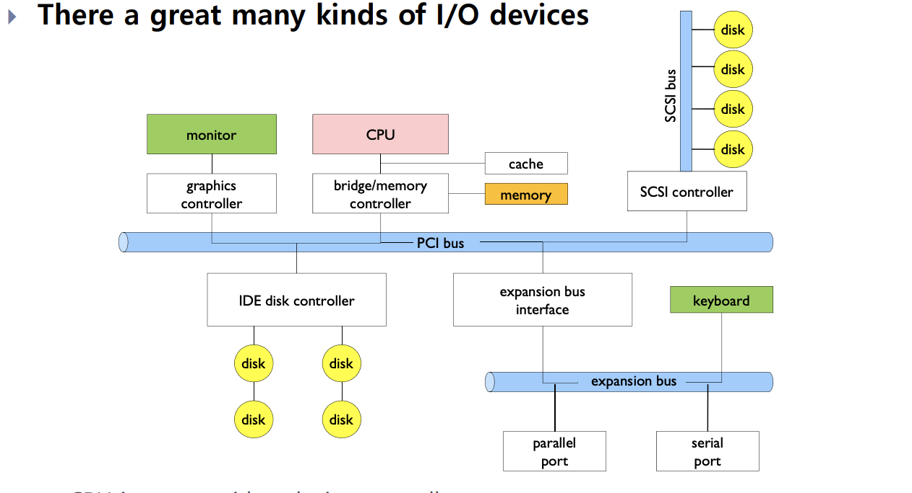
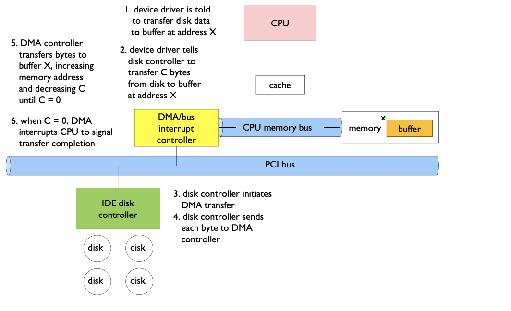

# I/O Systems

- 입출력 시스템을 설명할 수 있다.

### Modern I/O Systems

Cpu는 device controller와 interact한다.

- Device controller는 read/write될 수 있는 register를 포함하고 있다.

### Programmed I/O

#### Port I/O

Special processor instructions used to transfer data

- 각각의 디바이스가 다른 I/O port를 이용함

#### Memory-mapped I/O

- disk controller에 있는 registesr와 물리 주소공간이 매핑 되어있음
  - Addreses are set by hardware jumpers or programming at boot time
- I/O is accomplished with load and store instruction
- I/O address space는 system memory address space 공간을 차지하여 process가 이용할 수 없다.

### Direct Memory Access

- Used to avoid programmed I/O for large data movement
- Gives the access to memory bus to the DMA controller 
- DMA controller에게 제어권을 넘기고 CPU는 한번 입출력의 개시 명령을 내리고 다른작업을 할 수 있음 ( I/O interrupt )
- Bypasses CPU to transfer data Directly between I/O device and memory  

### Polling vs Interrupt

Os needs to know when I/O device has completed an operation

#### Interrupt

- 하드웨어적으로 하드웨어의 변화를 감지하여 외부로부터 입력을 CPU가 알아채는 방식
- ISR ( interrupt service routine )을 실행하여 그 변화에 대한 응답을 하게 됨
- I/O device generates an interrupt whenever it needs service
- 예측하지 못한 이벤트에 대해 조치를 잘 할 수 있음
- device driver에 의해 handle됨

#### Polling 

- CPU에 dependent하지 않고 하드웨어의 변화를 지속적으로 계속 읽어 들여서 변화를 감지
- I/O device puts completion information in status register
- OS periodically checks device-specific status register
- It may waste many cycles if infrequent or unpredictable I/O operations

interrupt와 polling 방식을 같이 쓰는 high bandwidth network device가 있음

- interrupt for first incoming packet
- polling for following packets

