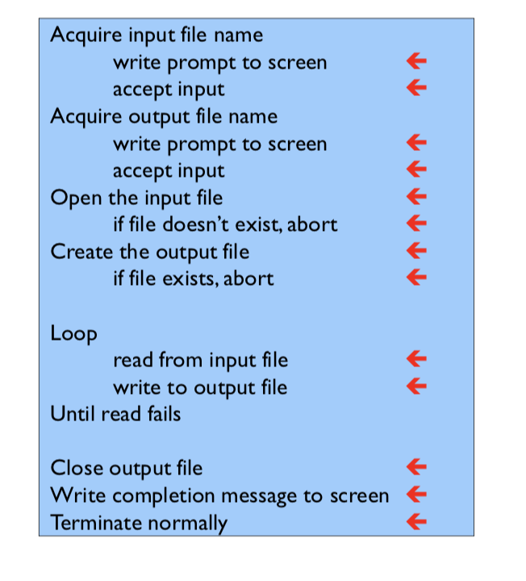
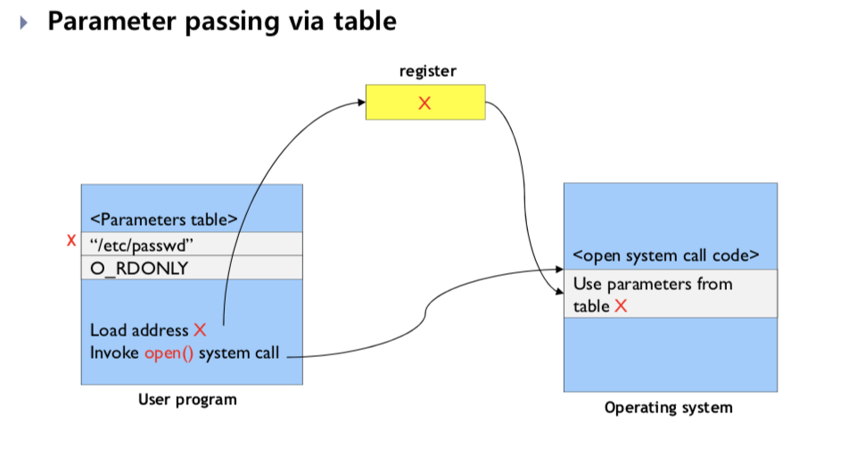

# 운영체제 2장

- 학습목표
  - 운영체제의 서비스를 이해한다
  - 시스템콜을 이해한다
  - 운영체제의 구조를 이해한다
  - 컴퓨터시스템의 부팅과정을 이해한다

## Operating System Structure

### Operating System Services

#### operating system provides the following services that are helpful to the user

- user interface
  - CLI
  - batch interface
  - GUI
- program execution
  - Normally or abnormally ( indicating error)
- I/O operations
- File system manipulation
  - chapter 1 에 설명되어있음 (file system)
- Communications
  - shared memory : 프로세스 간 메모리를 공유
  - message passing : 커널 영역에서 send/receive primitive message를 통해 통신한다.
- Error detection
  - need to be detecting Constantly

#### Os functions for efficient operations of system itself

- Resource allocation
  - 동시적으로 실행되고 있는 user, job에 자원이 다 할당되어야한다.
- Accounting
  - 누가 사용하고 있는지, 얼마나 사용하고 있는지, 무엇을 사용하고 있는지 track 해야함
- Protection and security
  - protection : control for access to system resources
  - security: user authentication, defense from invalid access attempts

#### OS User Interface

- CLI
- GUI

### System call

-  os가 제공해주는 interface

- 프로그램이  os에 서비스를 요청하는 방법

  - 하드디스크에 access하는 할때
  - 프로세스를 생성하거나 실행할때

- 프로세스와 os사이의 중요한 인터페이스 생성

- c나 c++로 만들어져 있다.

  

- 어떤 파일의 내용을 다른 파일로 복사하는 경우

  

### API

- 개발자에게 이용가능한 함수들을 제공
- common apis
  - Win32 api
  - POSIX API for POSIX-based system(unix/linux)
  - Java API for JVM
- 왜 system call 대신 api를 사용하는가
  - Portability
  - Easy to use

- 프로그래머가 시스템콜을 실행하는 것에 대해 몰라도 상관없다.
  - API와 os가 무엇을 하는지 이해해도 된다.
  - API에 의해서 os의 디테일이 프로그래머에게 숨겨진다

### system call vs API

- Kernel level - system call

- system call의 종류는 그렇게 많지 않음

### system call handling

[ 리눅스 fork](http://blog.naver.com/PostView.nhn?blogId=lee_seha&logNo=220337575979&parentCategoryNo&categoryNo=33&viewDate&isShowPopularPosts=true&from=search&fbclid=IwAR0e33pquA88t8n0IGle_Eckog2pE_wc6WKOJXpAgoYL1y32dI1idLKHi0Q)

### System call parameter passing

- Often, more information is required than simply identity of desired system call

  - 매우 디테일한 정보까지 지정해야될 수 있다.

- Three methods for passing parameters to the OS
  - pass the parameters in <b>registers</b>

  - store parameters in a table( or block ) on memory, and then pass <b>the address of table</b> in a register

    - Linux, Solaris

    

  - push parameters onto the <b>stack</b> by program, and pop off the stack by OS.

  

### types of System calls

일반적인 커널의 파일저장, 프린트 실행, 패킷전송 등 하드웨어를 사용하는 모든 기능은 system call을 사용

- Process control
  - create/terminate, load/execute, wait/signal event
  - Fork, execve(), getpid(), signal()
- File Management
  - create/delete, open/cloase, read/write
  - Open(), read(), write(), close()
- Memory management
  - allocate memory
  - brk()
- Information maintenance
  - get/set timer or date, get/set process, file, or device attributes
  - time()
- Communications
  - create/delete connection, send/receive message
  - socket(), bind(), connect()

### Operating System Design and Implementaion

#### Design goals

##### Choice of hardware and system type

- batch, time sharing, single/multi user, distributed, real-time

##### requirementes

- userview
  - Convenient to use, easy to learn, reliable, safe, and fast
- System's view
  - easy to design, implement, and maintain
  - flexible, reliable, error-free, efficient

##### Seperation of policy from mechanism

- The separation of policy from mechanism is a very important principle, it allows maximum **flexibility** if policy decisions are to be changed later
  - policy 변경에 민감하지 않은 일반적인 mechanism이 바람직
    - policy의 변경은 시스템의 일부 매개변수만을 재정의하도록 요구
  - 운영체제 모듈화
- Mechanism
  - determine how to do something (어떤일을 어떻게 할지 결정)

- Policy
  - determine what will be done ( what to do) ( 목적이 있음) 어디에 집중할 지

##### Implementation

- 이전에 어셈블리였던 것들이 지금은 c나 c++로 작성됨

- <b>Data structures and algorithms</b> are important rather than assembly language implementation.
  - Memory management, CPU scheduling, etc. 

### Operating system structures

#### Simple structure

- Interfaces and levels of functionality are not well seperated

- Applications can acess I/O routines directly

- It may cause entire system crash when an application fails.

  

#### Layered structure

- Os is divided into a number of layers (levels)

- The bottom layer ( layer 0 ) is the hardware.

- The highest layer(layer N-1) is the user interface 

- Easy to debug, but difficult to define the layers and not efficient

- 각 계층은 system call에 오버헤드를 추가

  - 오버헤드 발생 - 효율 감소

  

#### Microkernel structure

- Moves as much from the kernel into "user" space

- Communication between user modules with **message passing**

  - file access through file server

- easy to extend, easy to port

  - 커널의 변경을 필요로 하지 않음( do not require modification of the kernel)

- reliable and secure ( **less code is running in kernel mode**)

  - most services are running as user - rather than kernel - process

- performance degradation

  - because of frequent communication between user modules and kernel - make overhead - 성능감소
    - Mach, QNX, windows NT

  

#### Module structure

- Most modern operating systems implement kernel as modules
- it uses **object-oriented approach**
- Each core component is seperated
- Each talks to the other over known interfaces (any module can call any other module)
  - layered system 보다 훨씬 flexible
- Each is loaded into the kernel as needed
- solalis, linux, mac os x
- Microkernel 과 유사점
  - 다른모듈의 적재방법, 모듈들과의 통신방법을 알고 있음
- Microkernel 과 차이점
  - message passing이 필요없음(do not invoke message passing) - 더 효율적

### System boot

#### How to load Kernel

- Bootloader
  - run diagnostics, initialize system
  - locates the kernel, loads it into memory, and starts it
- small system
  - store bootloader and OS in ROM
  - Bootstrap code가 변경이 필요할시
    - ROM 하드웨어칩이 교체가 필요한 문제가 발생하여 EPROM 등장
  - ROM을 firmware라고 부름 (hardware과 software의 중간적 특성)
  - firmware의 단점
    - RAM보다 실행속도 느림
- Large system( PC)
  - **Store bootloader in ROM** and **OS in disk**, respectively
    - 각자 다른 부분에 존재
  - simple boot loader in boot block -> complicated bootloader -> kernel
    - boot loader runs diagnostic
    - read boot block ( 디스크에 저장되는 부팅프로그램을 담을 수 있는 디스크블록)
    - execute code from boot block
    - complicated enough to load the entire os
    - find kernel -> load memory -> execute

### System boot in linux

- 메인보드에서 BIOS 실행
- ROM BIOS가 수정되고 boot loader 까지는 os가 아님
- 커널 적재후 - 메모리에 커널 올린 후 os 시작
- 메모리에 마운트

### Summary

- Modern operating systems such as microsoft windows, Apple Mac OS, and Linux provide both CLI ( command line interface) and GUI ( Graphic User Interface).
- System call is the interface between processes and operating system, and provides how processes request services from operating system.
- Application programmer needs to understand how to use APIs rather than system calls.
- Modern operating systems are written in high level language like C or C++.

