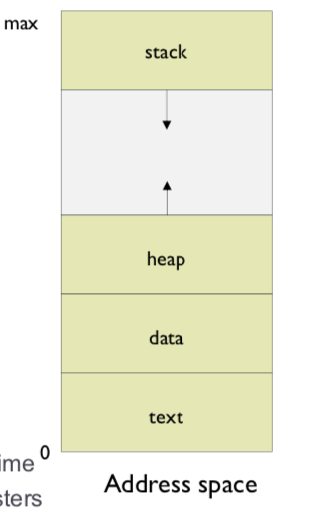
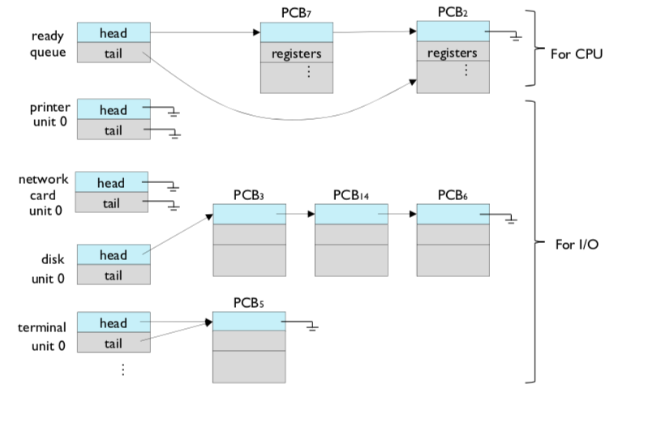
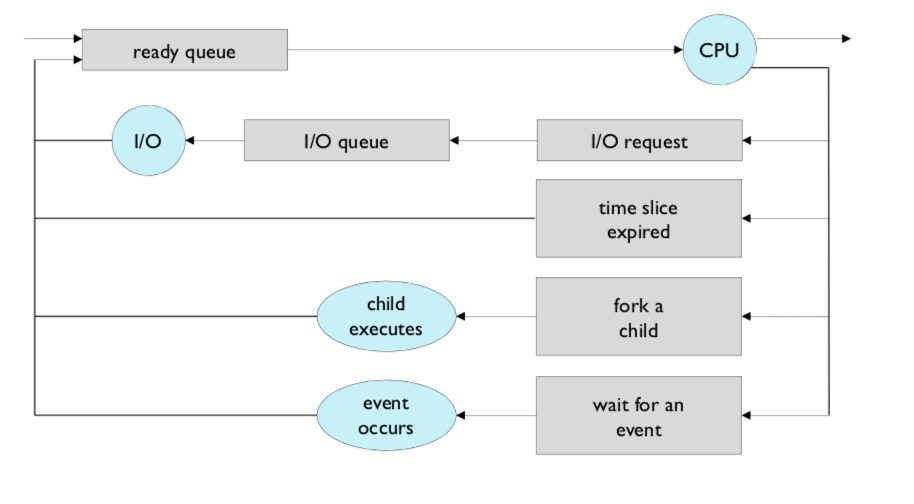

# Processes

- 프로세스의 개념을 이해한다
- 프로세스 관리 기법을 이해한다
- 프로세스간 통신 기법을 이해한다

## process concept

### Operating system executes a variety of programs

- Batch system - jobs
- Time-shared systems - user programs or tasks
  - JOB과 process는 유사하다

### Process

- A program in execution ( 수행중인 프로그램)

### A process includes

- The program code, also called **text section**
- **Data section** containing global variable, static variable
- **Stack** containing temporary data
  - Function parameters, return addresses, local variables
- **Heap** containing memory dynamically allocated during run time ( 수행중에 메모리가 달라짐)
- Current activity including **program counter**, processor registers( the value of the program counter , the contents of the processor's registers)

#### program vs process

- program : passive
  - ex ) 명령어 리스트를 내용으로 가진 디스크에 저장된 파일
- process : active
  - 다음에 실행할 명령어를 지정하는 프로그램 카운터와 연관된 자원의 집합을 가진 능동적인 존재
- 실행파일이 메모리에 적재 될 때 프로그램이 프로세스가 됨

## Process State

### As a process executes, it changes state

- New
  - The process is being created
- Running
  - Instructions are being executed
- wating ( block, sleep)
  - The process is waiting for some event to occur
- Ready
  - The process is waiting to be assigned to a processor
- Terminated
  - The process has finished execution

## process control Block

- task control block 으로 불림

- Metadata to manage data

  - process Control Block for process, Task Control Block for Task

  - task_struct 라는 구조체안에 정보가 들어잇음

  - File Control Block for file

    - vnode in unix file system

    

- Information associated with each process

  

  - process counter
    - address of the next instruction
  - CPU registers: 누산기, 색인 레지스터, 스택 레지스터, 범용 레지스터들과 상태 코드 정보가 포함된다. 

  - 프로그램 카운터와 함께 이 상태 정보는 나중에 프로세스가 계속 올바르게 수행되도록 하기 위해서, 인터럽트 발생시 저장되어야 한다. (PCB save, reload)
  - CPU scheduling information
    - Priority

  - memory-management information
    - Page table, segment table, the value of the base and limit register
  - Accounting information
    - Amount of CPU used and real time used, time limits
  - I/O status information
    - The list of I/O devices allocated to the process, Open files

## Threads

### process Scheduling

- multiprogramming의 목적
  - to have some process running at all times, to maximize CPU utilization.
- time sharing 의 목적
  - to switch the CPU among processes so frequently that users can interact with each program while it is running.
- 이러한 두 목적을 만족시키기 위해서는 process scheduler가 필요하다. 

### process Scheduling queues

Process가 시스템에 들어오면 job queue에 놓여짐.

- Ready queue

  - set of all processes residing in main memory and waiting for execution
  - linked list
  - 헤더 : list의 첫번째와 마지막 PCB를 가리키는 포인터포함, PCB는 Ready queue의 다음 PCB 가르키는 포인터필드를 가짐( program counter )

- Device queues

  - set of processes waiting for an I/O device( 입출력 장치를 대기하는 프로세스)
  - Each device has its own device queue.

- Processs migrate among the various queues

- Ready queue and various I/O device queues

  

- Representation of process scheduling

  

## Schedulers

- CPU scheduler
  - selects which process should be executed next and allocates CPU( 스케쥴러는 cpu에 할당할 프로세스를 고른다.)
- Processes can be classified into 
  - I/O-bound process
    - spends more time doing I/O than computations
    - many short CPU bursts ( CPU를 조금조금씩 끊어서 사용)
  - CPU-bound process
    - spends more time doing computations
    - a few very long CPU bursts(한번에 많이 사용)
- Scheduling algorithms are studied later.

## Context switch

- 인터럽트로 context switch가 발생

- 어떠한 프로세스를 수행하는 일정시간이 지나면 다른 프로세스를 진행하게 되고 이후에 해당 프로세스를 다시 불러서 사용한다. = context switch
- **when cpu switches to another process, the system must**
  - save the state of the old process, and load the saved state for the new process ( PCB 즉 메모리에 저장함)
- **context switch time is pure overhead.**
  - system does not any useful work while switching
- context switch time depends on hardware
  - the register set is different
  - context switch overhead를 줄이기 위해서 하드웨어의 지원이 필요하다
- Cpu switch from process to process
- 너무 자주 빈번하게 하다보면 오버헤드 발생후 컴퓨터가 더 느려질 수 있음(수행시간보다 바꾸는 시간이 길면)

## Process creation

#### Process creation

- parent process creates child processes,
- which, in turn creates other processes.
- Finally it forms a tree of processes

#### child processes need resources

- os gives, or
- parent shares

#### Resource sharing

- Parent and Children share all resources,
- Children share subset of parent's resources, or
- Parent and Child share nor resources.

#### Execution

- Parent and Child execute concurrently or 
- parent waits until child terminate

#### Address space

- Child duplicates parent, or
- Child has a new program loaded into it

#### Summury or process creation

- Create PCB within OS kernel.
- Allocate memory space.
- Load binary program
- Initialize the program

#### Unix example

- fork system call creates new process
  - duplicate parent's PCB.
  - allocate memory space
- execve system call is used after a fork
  - load binary program disk
  - Initialization
- 장점
  - 사용자가 프로세스의 내용을 결정할 수 있음

### Process Termination

#### Process executes last statement and asks operating system to delete itself(exit)

- Child process returns a status value to its parent(wait) 
  - wait 콜을 통해 status return
  - 이게 안되면 child process 가 zombie ( 어떤 부모도 wait call 이 없어서 ( 기다리지 않으면 ) )
- Child process resource are deallocated by operating system.
  - exit call 을 받기전에 parent 가 죽어버린 경우 orphan

#### Parent may terminate execution of child processes (abort)

- If child has exceeded the allocated resources.
- It task assigned to child is no longer required.

##### Cascading termination

- The termination is initialed by the operating system
- Some operation systems do not allow child to exist if its parent has terminated. If a process terminates, then all its children must also be terminated

## Cooperating processes

- independent process
  - Cannot affect or be affected by the execution of another process
- cooperating process
  - independent process 와 반대
- Advantage of cooperating
  - information sharing
    - shared files..
  - computation speed-up
    - pararell execution via subtasks
  - Modularity
    - Division the system function into seperate tasks
    - 시스템 기능의 별도의 프로세스들 또는 쓰레드들로 나누어 모듈식 형태로 시스템을 구성할 수 있다.
  - convenience
    - 같은 시간안에 많은 task를 할 수 있음

### Communication models

#### Message passing

- useful for exchanging smaller amounts of data, because no conflicts need be avoided.
- easier to implement in distributed system than shared memory
- 프로세스간 메모리 공유없이 동작 가능
- 커널을 공유하여 속도가 느리다
- eastablish a communication link between them

- context switching 관점
  - IPC를 많이 할 수록 make overhead ( chapter2 - os structure Microkernel structure)
  - send, receive 시에 context switching 발생

#### Direct communication

- process must name each other explicitly (명시적으로)
- All references to old identifier should be found and changed

#### Indirect communication

- Messages are sent to and recieved from mailboxes or ports
- Mailbox
  - object into which messages can be placed by process and from which messages can be removed
  - Each mailbox has a unique id
  - process can communicate only if the share a mailbox
  - operation
    - create a new mailbox
    - send and receive messages through maiolbox
    - destroy a mailbox

#### Synchronization

- Message passing may be either blocking or non-blocking
- **Blocking** is considered synchronous
  - Blocking send has the sender block until the message is received ( 송신자 block) - 동기 send
  - Blocking receive has the receiver block until a message is available ( 수신자 block) - 동기 수신
- Non-blocking is considered asynchronous
  - Non blocking send has the sender send the message and continue
  - Non blocking receive has the receiver receive a vaild message or null ( 일단 어떤 것이든 받는다.)

#### Shared memory

- a shared memory region resides in the address space of the pocess creating the shared memory segment ( 공유메모리 생성하는 프로세스의 주소공간)

- 두개이상의 프로세스들이 주소공간의 일부를 공유하며 공유한 메모리 영역에 읽기 쓰기가능
- 공유메모리가 설정되면 그 이후 통신은 커널 관여없이 가능 => 메모리를 직접 사용하여 IPC 속도가 빠름
- responsible for ensuring that they are not writing to the same location simultaneously.

## Producer-consumer problem

- Producer process produces information that is consumed by a consumer process
  - A compiler may produce assembly code, which is consumed by an assembler
  - The assembler produce object modules, which are consumed by the loader.
- Unbounded-buffer
  - Places no practical limit on the size of the buffer
    - Consumer may have to wait for new items
    - producer can always produce new items
- Bounded buffer
  - assumes fix buffer size
  - In this case the comnsumer must wait if the buffer is empty and the producer must wait if the buffer is full
- 해결책 중 하나
  - Shared memory solution

