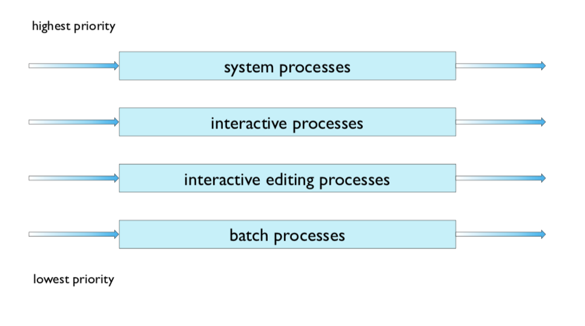
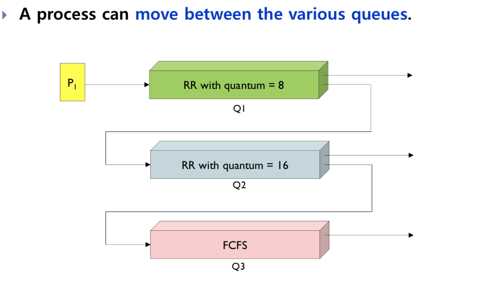

# CPU scheduling

- CPU 스케쥴러의 역할을 설명할 수 있다.
- 각 CPIU 스케쥴링 알고리즘의 동작방식을 설명할 수 잇다.
- 각 CPU 스케쥴링 알고리즘의 장단점을 설명할 수 있다.

## CPU scheduler

- select a process from the processes that are ready to execute
- CPU scheduling decisions may take place when 
  - a process switches from running to waiting state (I/O request, event)
  - The a process switches from running to ready state ( time slice expriation)
  - a process switches from waiting to ready ( I/O completion)
  - a process terminates
  - [process state](./os_chater3.md)

#### Dispatcher

- gives CPU control to the process selected by CPU scheduler
  - switches context
  - switches to user mode
  - jumps to the proper location to restart the selected process
- Dispatch latency
  - time it takes for dispatcher to stop one and start another process
  - scheduling overhead

## Scheduling criteria

- CPU utilization
  - keeps the CPU as busy as possible
  - Maximize good
- Throughput
  - the number of processes that are completed per time unit
  - Maximize good
- Turnaround time
  - time from the submission of a request to time of completion
  - Minimize good
- waiting time
  - sum of time a process has been waiting in the ready queue
  - Minimize good
- Response time
  - time from the submission of a request untill the first response is produced
  - Minimize good
  - it may be more importatn to minimizae the  than the the average of response time
    - example : interactive system

## Scheduling algorithm

### FCFS

#### First come First served

- like FIFO
- Non-preemptive 비선점 방식

### SJF

#### Shortest-job-Fisrt

- Assign CPU to the process that has the smallest CPU burst
- Non-preemtive
  - once CPU is given to a proecss, it cannot be preempted

- Preemtive

  - SRTF

  - Short remaining time First
  - 현재 실행되고 있는 프로세스보다  cpu burst가 더 적은 프로세스가 도착하면 preempt 한다.

- SJF is optimal in terms of average waiting time
- Determining the lengths of next CPU bursts time is required

### Priority Scheduling

A priority number(integer) is associated with each process

- The CPU is allocated to the process with the highest priority
- SJF is a kind of priority scheduling
- Problem
  - Starvation
    - low priority processes may never execute
- Solution
  - Aging
    - As time progresses, increase the priority of the process

### Round Robin(RR)

Each process gets a small unit of CPU time

- time quantum, or time slice
- 시간이 지나면 process is preempted and added to the end of the ready queue
- time quantum이 q 일 시 
  - ready queue에 있는 n개의 프로세스는 (n-1)q 시간단위를 초과하여 대기하지 않는다.
  - q 가 크면 FCFS
  - q가 작으면 context switching 오버헤드가 매우크다.

## Multilevel Queue

- Ready queue is partitioned into seperate queues
  - foreground queue(for interactive processes)
    - RR
  - background queue(for batch system)
    - FCFS

- Scheduling must be done between the queues
  - Fixed priority scheduling
    - services process in foreground queue first
    - possibility of starvation
  - Time slice
    - each queue gets a certain amount of CPU time

#### Multilevel feedback queues

### Multi-processor scheduling

- Multi-processor scheduling is **more complex** than single processor cheduling

#### two types of schduling

- Asymmetric multiprocessing
  - Master processor performs scheduling decision, the others execute user code.
- Symmetric multiprocessing(SMP)
  - Each process makes its own schedulng decisions.
  - Currently most common
- New issues for multi-processor scheduling
  - processor affinity
    - keeps a process running on the same processor
  - Load balancing
    - keeps the workload evenly distributed across all processors
    - push migration, pull migration

