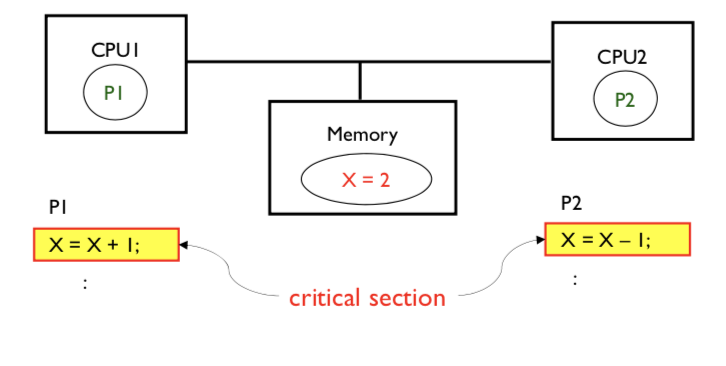
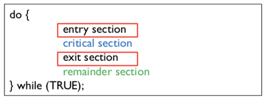
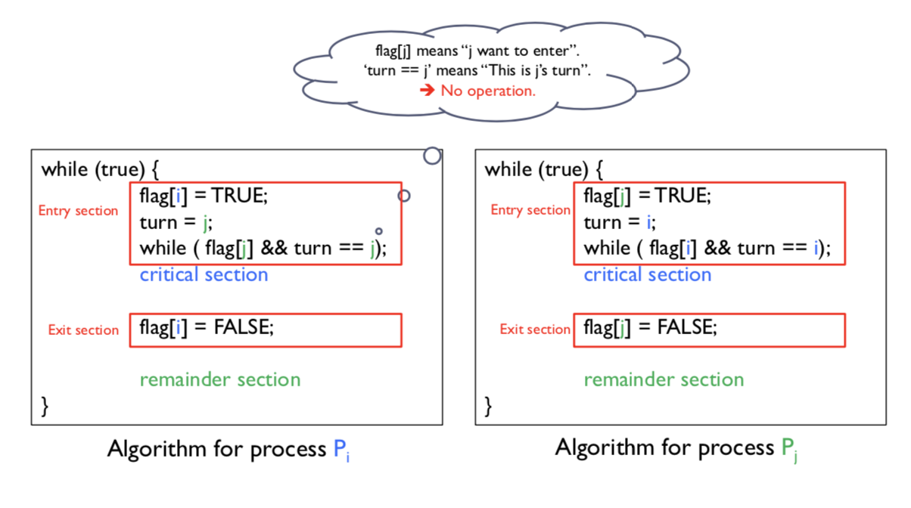
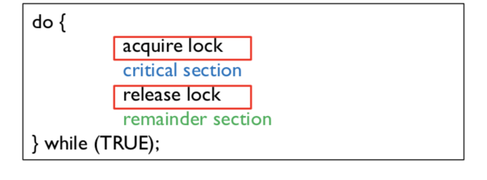
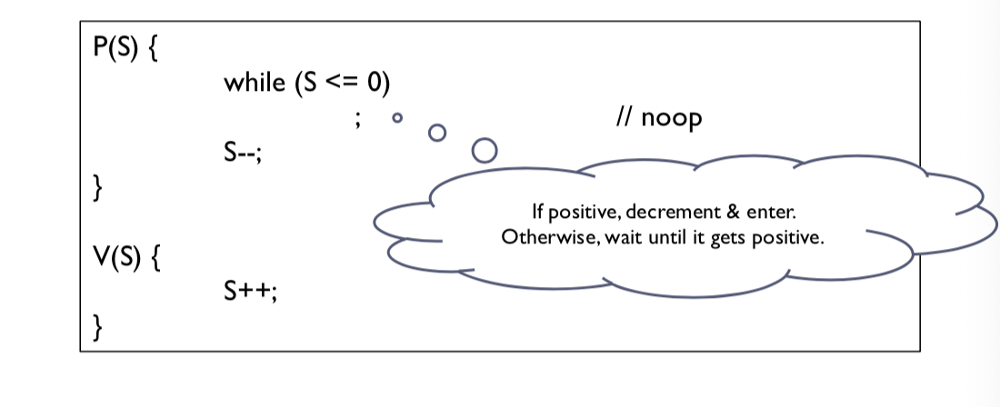
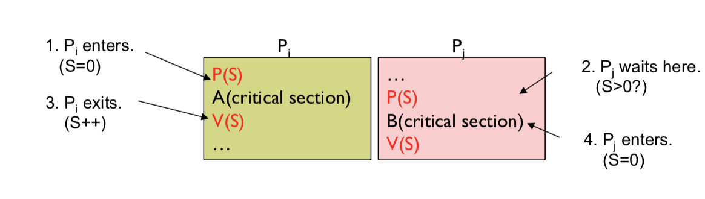
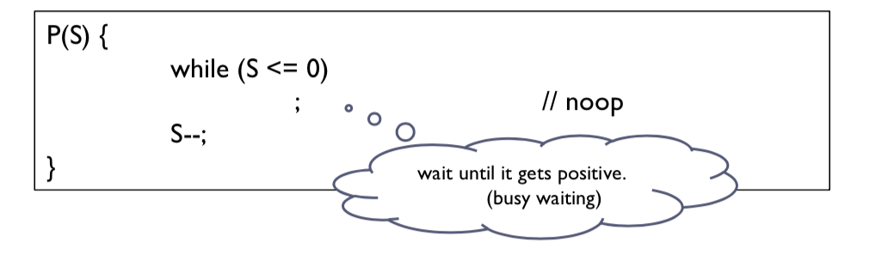
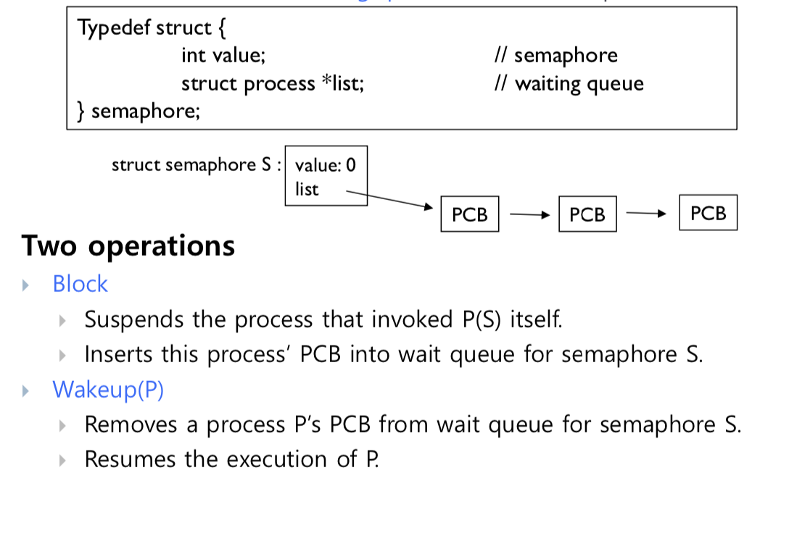
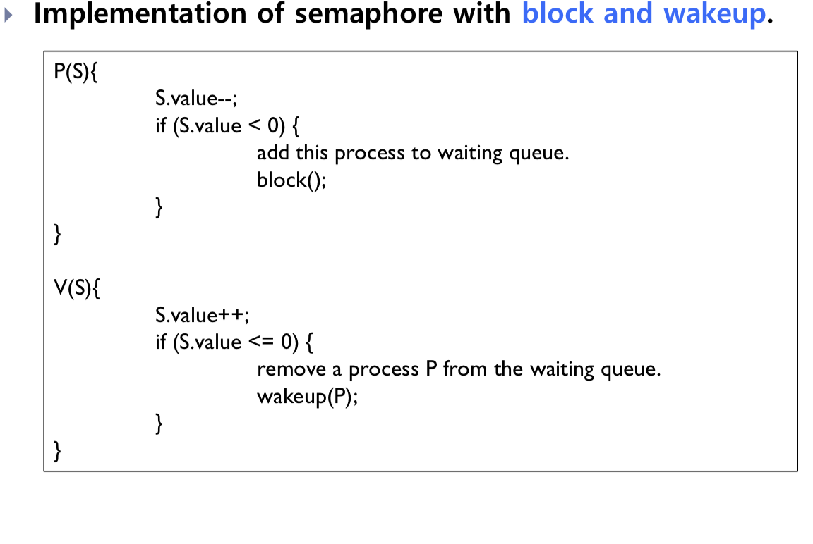

# os 6장 Synchronization

- 동기화의 필요성을 설명할 수 있다.
- 임계구역 문제를 설명할 수 있다.
- 세마포어의 정의와 사용법을 설명할 수 있다.


## Race Condition

- 공용 데이터를 Concurrent 하게 access하면 data 의 inconsistency가 발생 할 수 있다.
- Race condition을 막기 위해서는 synchronized 되어야 한다.
- uniprocessor environment(CPU가 하나) 에서는 CPU scheduler 에 의해서 race condition이 발생가능하다.
  - round robbin 같은 알고리즘의 경우 일정 수행시간이 지나 스케줄링이 변경되므로 Race condition이 발생함

## Critical Section Problem

- Critica section

  - A code segment in which the shared data is accessed

  

  - ensure that when one process is executing in its critical section, no other processes are allowed to execute in its critical section ( 방해불가 )

- It is required to design a protocol that the processes can use to cooperate

- General structure of a typical process PI



- 세마포어 , 락 등등

## Requisites for solution

- Mutual Exclusion ( 상호 배제)
  - 프로세스 PI가 critical section에 있으면 다른 프로세스는 수행할 수 없다.
  - Progress
    - critical section에 프로세스가 들어가 있지 않을때
    - 여러 프로세스가 critical section에 들어가기를 원하고 있을 때
    - 선택받지 못한 프로세스가 무기한으로 기다리면 안된다.

  - Bounded waiting
    - time bound는 starvation을 막기 위해 존재한다.

## Peterson's Solution

- two processes syncronization 의 솔루션
- 두 프로세스는 두개의 variables를 공유한다

```c#
int turn;
// whos turn it is to enter the critical selection
bool flag[2]
// indicates if a process is ready to enter the critical selection
//flag[i] = true, if process Pi is ready
```



- turn 에 i 와 j 가 동시에 initialization이 되는 경우는 없어야 함
- 둘다 flag[n] 가 True이므로 들어갈 대기를 하고 있고
- turn이 마지막에 초기화된 값으로 결정되어 서로 while 문의 조건이 다르므로 동시에 들어가는 것을 방해한다.

## Syncrhronization Hardware

- simple tool : lock



- Modern machines provide special atomic hardware instructions
  - Atomic = non-interruptable
  - Either test memory word and set value, or 
  - swap contents of two memory words
- TestAndSet instruction

```c
boolean TestAndSet( boolean *target){
  boolean rv = *target;
  *target = TRUE;
  return rv
}
```

- Shared boolean variable lock is initialized to false
- solution

```c
while(true){
  while(TestAndSet(&lock)); /*do nothing */
  //critical section
  lock = FALSE;
  remainder section
}
```

- Swap instruction

  - switch the values of tow words

  ```c
  void Swap( boolean *a, boolean *b){
    boolean temp = *a;
    *a = *b
    *b = temp;
  }
  ```

  - Shared boolean variable lock is initialized to False
  - Each process has a local boolean variable key


  ```c
  while(true){
    key = TRUE;
    while( key == TRUE)
    	swap(&lock, & key);
    	//key - true 들어가고 싶다
    	//lock - true 누가 들어가 있다.
    	
    //critical section
    lock = FALSE;
    remainder section
  }
  ```

## Semaphore

- Semaphore S
  - just protected integer variable
  - faciliate and restrict access to shared resources in a multi processing environment
- Two standard operations to modify S
  - wait() and signal()
    - originally called P() and V()



- Usage of semaphore
  - S는 1로 초기화



- Binary semaphore
  - integer value can range only between 0 and 1
  - provides mutual exclusion
  - 하나의 프로세스로 락이 걸림
- Counting semahpore
  - integer value 가 unrestricted domain range를 가지고 있음

## Semaphore implementation

- Busy waiting
  - while a process is in critical section, other processes must loop continuously. 
  - is also called a **spin lock** 
  - wastes CPU cycles



- Block and wakeup

  - waiting queue for each semaphore

  

  

- Busy waiting vs Block-wakeup
    - Busy waiting
      - No context switching is required
        - 한 프로세스가 계속 CPU를 가지고 있음
      - critical section 수행시간이 짧을때 좋음
    - Block-wakeup
      - Context switching is required
      - critical section 수행시간이 길때 좋음

