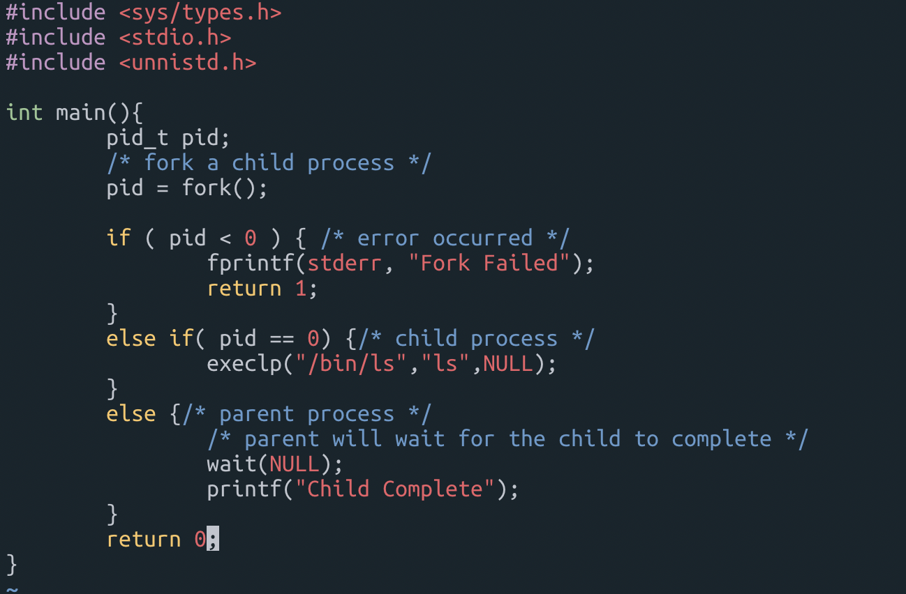
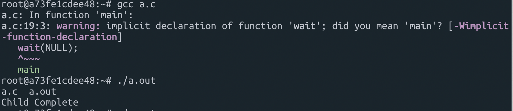
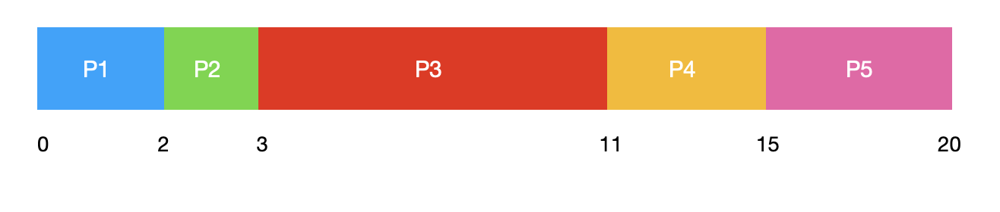
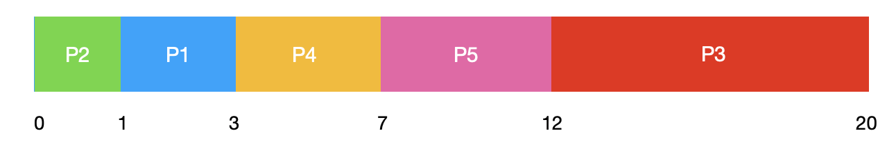
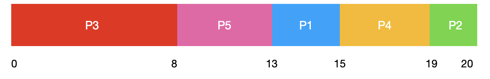
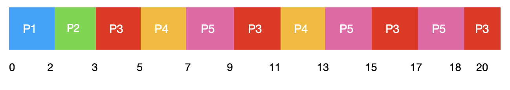

# 운영체제 레포트

<div style="text-align: right"> 19110117 이재규 </div>

### 1. 리눅스에서의 프로세스의 정보를 담는 task_struct 구조체의 주요한 attribute를 적고 간략히 설명하시오.(include/linux/sched.h )

프로세스는 자신만의 자원을 가지고 있으며 리눅스에서는 이러한 것들을 관리해주기 위해 각 프로세스마다 task_struct 라는 구조체를 생성한다. 각자의 프로세스는 자신만의 context를 가지고 있어서 해당 정보는 task_struct 구조체로 관리되고 있다.

Task_struct 구조체는 커널 레벨에 존재한다.

-----

​		[ process A ]							[ process B ]

[process discriptor]\[ task_struct ]		  [process discriptor]\[ task_struct ]
	    PCB : 테스크 구조체					PCB : 테스크 구조체

----

​		   [process C]

​	  [Thread A]\[Thread B]

[process discriptor A]\[ task_struct A]

[process discriptor B]\[ task_struct B ]

linux 에서는 thread와 process를 구분하지 않기 때문에
process, thread 모두 task_struct 구조체가 동일하게 생성되고 관리됨.

----

각각의 프로세스는 task_struct를 가지고 있다. 리눅스에서는 해당 구조체를 sched.h에 정의한다.

##### task_struct의 구조

- Task Identification
  - task를 인식하기 위한 변수들
    - pid : task id
    - tgid : task가 속해있는 쓰레드 그룹 ID
  - 커널이 유지하고 있는 hash 관련 필드 변수
    - uid : 사용자 id
    - euid : 유효사용자 id
    - suid : 저장된사용자 id
    - fsuid : 파일 시스템 사용자 id
    - gid, egid, sgid, fgid : 사용자 그룹에 대한 접근제어에 이용되는 변수

- State

```c
volatile long state;
//비동기적으로 state가 변하는 것을 반영하기 위해서 volatile 선언
//인터럽트 루틴에서 해당 값을 변경할 수 있음
#define TASK_RUNNING 0 //실행중
#define TASK_INTERRUPTIBLE 1 //휴식상태 - 시그널로 실행가능
#define TASK_UNINTERRUPTIBLE 2 //휴식상태- 조건이 맞을때까지 대기
#define TASK_ZOMBIE 3 //소멸되었지만 태스크 구조가 남아있음
#define TASK_STOPPED 4 //시그널에 의해 정지상태에 있음
#define TASK_SWAPPING 5 //사용되지않음
```

- Task relationship

  - real_parent : 현재 태스크를 생성한 부모 태스크의 task_struct 구조체를 가르킴
  - parent : 현재 부모 태스크의 task_struct 구조체를 가르킴
  - tasks : 리스트 헤드, 이중연결 리스트로 모든 태스크가 연결되어있음
  - run_list : 현재 task_running 상태의 task들은 run_list 필드를 통해 이중연결 리스트로 연결됨

- Scheduling information

  - prio, array, policy, cpus_allowed, time_slice, rt_priority, timeout

  ```c
  unsigned long policy, rt_priority;
  // scheduling policies
  #define SCHED_OTHER 0
  #define SCHED_FIFO 1
  #define SCHED_RR 2
  //rt_priority
  // 실시간 스케줄링을 위해 지원하는 우선순위 설정값
  ```

- Signal information

  - signal, blocked, sighand, pending

  ```c
  unsigned long signal;  //init 0
  unsigned long blocked; //init 0  //bitmap of masked signals
  //시그널은 태스크에게 비동기적인 사건의 발생을 알리는 매커니즘
  //signal과 blocked 변수는 프로세스가 받은 시그널과 받지 않도록 설정한 시그널을 나타내는 변수
  //변수의 한 비트는 한 시그널에 대한 마스크로 사용된다.
  ```

- Memory information

  - 태스크는 자신의 명령어와 데이터를 텍스트, 데이터, 스택, 그리고 힙 공간 등에 저장함
  - task_struct에는 이 공간에 대한 위치와 크기, 접근 제어 정보 등을 관리하는 변수들이 존재한다. 또한 가상 주소를 물리 주소로 변환하기 위한 페이지 디렉터리와 페이지 테이블 등의 주소 변환 정보들도 존재한다.

  ```c
  struct mm_struct *mm;
  ```

  - mm_struct는 프로세스의 메모리 상에서의 위치를 나타내는 메모리 맵 저옵를 가지고 있다.

- file information

  - Files : 태스크가 오픈한 파일들은 files_struct 구조체 형태인 files 변수로 접근할 수 있다.
    - 오픈한 파일의 딕스크립터와 그 밖의 정보를 담고 있음
  - fs : 루트 디렉터리의 inode와 현재 디렉터리의 inode는 fs_struct 구조체 형태인 fs 변수로 접근할 수 있다.

  ```c
  struct fs_struct *fs; //init &init_fs
  stryct files_struct *files; //init &init_files
  
  struct files_struct{
  	int count;
    fd_set close_onexec;
    fd_set open_fds;
    struct file *fd[NR_OPEN];
  }
  
  struct fs_struct{
    int count;
    unsigned short unmask;
    struct inode *root, *pwd;
  }
  ```

- thread structure

  - thread_struct는 include/asm/processor.h에 정의되어있으며 사용자 모드에서 커널모드로 진입할때 현재 프로세스에 대한 모든 정보를 저장한다.
    - 문맥 교환을 할때 태스크가 현재 어디까지 실행되었는지 기억해 놓는다.
  - 이 구조체는 스레드에 해당되는 레지스터 값과 세그먼트, 디버깅 레지스터, 부동 소수점 정보등을 담고 있다.

- time information

  - 다양한 시간 정보들이 프로세스들에 의해서 사용된다. 리눅스에서 시간들은 항상 ticks안에서 측정된다.
  - 해당 ticks는 타이머 인터럽트에 의해서 카운트 된다.

  ```c
  long utime, stime, cutime, cstime, start_time;
  ```

  - utime, stime은 각각 프로세스가 사용자모드와 시스템 모드에서 소비한 시간을 담고 있으며 cutime과 cstime은 모든 자식 프로세스들을 위한 각각의 대응하는 시간들의 총합을 담고 있다.
  - Start_time은 현재 실행중인 프로세스가 생성된 시간을 담고 있다.

- Format

  - personality
    - 리눅스가 linux exec 도메인 뿐만 아니라 BSD, SVR4 exec 도메인도 지워나가기 위해 사용되는 변수
  - binfmt

  ```c
  struct linux_binfmt{
    struct linux_binfmt *next;
    long *usecount;
  	int(*load_binary)(struct linux_binprm *, struct pt_regs * regs);
    int(*load_shlib)(int fd);
    int(*core_dump)(long signr, struct pt_regs * regs);
  }
  ```
  ​	리눅스는 현재 커널 수준에서 9가지의 실행파일 형식(다양한 이진 포맷 a.out, elf, java, shell script 등)을 지원하고 있다. 실행 파일 형식에 대한 모듈, 메모리로 로드하는 함수와 메모리 덤프를 하는 함수들에 대한 포인터를 가지고 있는 것이 linux_binfmt 구조체이다. include/linux/binfmt.h 에 정의 되어 있다.

- Resource limit

  - 태스크가 사용할 수 있는 자원의 한계

  ```c
  struct rlimit{
    //최대 허용자원의 수
    long rlim_cur;
    //현재 설정된 허용자원의 수
    long rlim_max;
  }
  ```

  

### 2. 유닉스, 리눅스, 윈도우(3가지 OS 중 하나)   프로세스 생성 프로그램 수행해보고 결과를 캡처해보시오.



docker 에서 ubuntu image로 해당 프로그램을 실행 시켜보았습니다.



gcc 로 c 파일을 out 파일 형식으로 바꿔 실행시킨 결과 Child Complete 라는 문자열이 출력됩니다.

### 3.Chapter 5, p.285  5.7 문제풀이

| 프로세스 | 버스트 시간 (밀리초) | 우선순위 |
| -------- | -------------------- | -------- |
| P1       | 2                    | 2        |
| P2       | 1                    | 1        |
| P3       | 8                    | 4        |
| P4       | 4                    | 2        |
| P5       | 5                    | 3        |

프로세스는 시간 0 에 P1,P2,P3,P4,P5로 도착한다고 가정한다.

**a. FCFS, SJF, 비선점 우선순위(높은 우선순위 값이 높은 우선순위를 의미) 그리고 라운드 로빈( 할당량 : 2 ) 스케쥴링을 이용해 프로세스들의 실행을 보이는 간트 차트를 그리시오.**

- FCFS

  - First Come First Service

    

- SJF

  - Shortest Job Find
  - 실행시간이 가장 짧은 프로세스에게 CPU할당하는 스케쥴링

  

- 비선점 우선순위

  - a larger priority number implies a highter prioirity

  

- Round Robin (quantum 2)

  - 순서대로 시간단위로 CPU 할당
  - 문맥전환의 오버헤드가 큰 반면 응답시간이 짧아지는 장점이 있음 - 실시간 시스템에 유리
  - quantum 이 길어질 수록 비선점FCFS 와 비슷해짐

  

  

  

**b. a의 스케쥴링 알고리즘 별 각 프로세스에 대한 총 처리시간은 얼마인가? **

- FCFS : 20
- SJF : 20
- 비선점 우선순위 : 20ㄷ
- Round Robin : 20

**c. a의 스케쥴링 알고리즘 별 각 프로세스에 대한 대기시간은 얼마인가?**

- FCFS : (2 + 3 + 11 + 15)/5 : 6.2
- SJF : (1 + 3 + 7 + 12)/ 5 : 4.6
- 비선점 우선순위 : ( 8+ 13 +15 + 19) /5 : 11
- Round Robin 
  - P1 : 0-0 = 0
  - P2 : 2 - 0 = 2
  - P3 : (18 - 17) + (15- 11) + (9-5) + 3 - 0 : 12
  - P4 : (11-7) + 5 - 0 : 9
  - P5 : (17-15) + (13 - 9 ) + 7 - 0 : 13
  - ( 0 + 2 + 12 + 9 + 13) /5 : 7.2

**d. 위의 알고리즘 중에서 어느 스케쥴이 최소의 평균 대기시간을 ( 모든 프로세스들에 대해 ) 보이는가?**

-  SJF 가 4.6초로 가장 짧은 대기시간을 보인다. 
